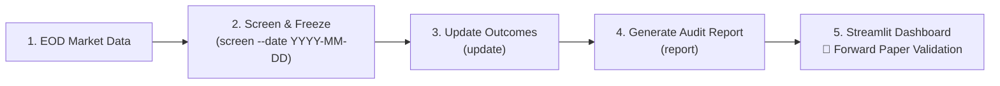

# Prospective Forward Validation Guide (Phase 11)

> **MANDATORY SCIENTIFIC PRINCIPLE — ZERO RETROACTIVE MODIFICATION**
> Prospective forward validation exists to evaluate whether the frozen Wyckoff/VSA research screener produces useful triage value when applied forward in time on genuine unseen market data. Every candidate snapshot is permanently frozen at screening date $T$. Future prices must NEVER influence historical candidate attributes, and historical candidate signals must NEVER be retroactively modified or deleted.

---

## 1. Purpose & Difference from Historical Backtesting

- **Historical Backtesting (Phase 10)**: Evaluates a quantitative engine retroactively across past historical data slices. While strict point-in-time isolation prevents lookahead leakage, historical backtesting inherently operates on already-known price history and current surviving constituent lists (survivorship bias).
- **Prospective Forward Validation (Phase 11)**: Operates strictly forward in time. Daily screening snapshots are generated and permanently sealed on day $T$ before future prices exist. Forward returns and path excursions (MFE/MAE) are recorded only as future trading sessions actually unfold. This provides the gold standard of zero-leakage, un-curve-fitted empirical evidence.

---

## 2. Daily Operational Workflow

The prospective forward validation workflow consists of three simple CLI operations and a monitoring dashboard:



### Step 1: Ingest Daily Market Data
Ensure the latest daily EOD OHLCV data for universe constituents is available in `data/research_datasets/` (or canonical data directory).

### Step 2: Screen and Freeze Daily Candidate Snapshot
```bash
python -m wyckoff_screener.forward screen --date YYYY-MM-DD
```
- Slices market data strictly to $Date \le T$.
- Executes the frozen Phase 9C Research Screening Engine.
- Generates deterministic 16-character SHA-256 candidate IDs.
- Writes an immutable JSON snapshot to `data/forward_validation/snapshots/snapshot_YYYYMMDD.json`.
- Registers candidates in `data/forward_validation/ledger/forward_ledger.csv` and initializes pending tracking records in `data/forward_validation/ledger/forward_outcomes.csv`.

### Step 3: Update Realized Outcomes as Future Trading Days Occur
```bash
python -m wyckoff_screener.forward update
```
- Scans all open candidates in `forward_outcomes.csv`.
- Evaluates subsequent trading bars ($T+1 \dots T+H$).
- Automatically transitions completed horizons from `PENDING` to `MATURED` and calculates exact close-to-close returns, MFE, and MAE.

### Step 4: Display Cumulative Forward Audit Report
```bash
python -m wyckoff_screener.forward report
```
- Outputs tabular performance summaries across candidate cohorts (`HIGH_PRIORITY_CANDIDATE`, `QUALIFIED_CANDIDATE`, `WATCHLIST`, `DISQUALIFIED`) for 10D, 20D, and 60D horizons.

### Step 5: Visual Inspection via Streamlit Dashboard
```bash
streamlit run dashboard/app.py
```
- Navigate to the **🔮 Forward Paper Validation** page to inspect active candidates, realized cohort performance, and historical baseline comparisons.

---

## 3. Lookahead Protection & Zero-Leakage Architecture

1. **Pre-Screening Point-in-Time Slicing**: When screening at date $T$, the data loader filters `df[df["Date"] <= target_date]`. Indicators (50/100 DMAs, 14-period RSI, 20-period ATR/BBW) cannot access future prices.
2. **Snapshot Immutability**: Candidate snapshots are stored in frozen dataclasses (`ForwardCandidateRecord`) and serialized to static JSON files.
3. **Exclusion of Screening Bar $T$**: Forward excursion windows evaluate strictly `prices[T+1 : T+H]`. Bar $T$ serves only as the reference price anchor ($P_T$) and cannot contaminate forward high/low excursions.
4. **Permanent Separation of Signals and Outcomes**: Modifying or appending future market bars alters only the outcome ledger (`forward_outcomes.csv`) and leaves the original candidate snapshot 100% byte-for-byte identical.

---

## 4. Forward Horizon Definitions

All forward horizons are measured in **trading sessions** (bars), not calendar days:
- **10D Horizon**: Exactly 10 subsequent trading bars ($T+1$ through $T+10$).
- **20D Horizon**: Exactly 20 subsequent trading bars ($T+1$ through $T+20$).
- **60D Horizon**: Exactly 60 subsequent trading bars ($T+1$ through $T+60$).

### Mathematical Definitions:
$$\text{Forward Return (Close-to-Close)} = \frac{\text{Close}_{T+H} - \text{Close}_T}{\text{Close}_T} \times 100$$
$$\text{Maximum Favorable Excursion (MFE)} = \frac{\max(\text{High}_{T+1 \dots T+H}) - \text{Close}_T}{\text{Close}_T} \times 100$$
$$\text{Maximum Adverse Excursion (MAE)} = \frac{\min(\text{Low}_{T+1 \dots T+H}) - \text{Close}_T}{\text{Close}_T} \times 100$$

---

## 5. Ledger Structure & Directory Layout

```
data/forward_validation/
├── snapshots/
│   ├── snapshot_20250103.json    # Immutable snapshot containing candidate records at T
│   └── snapshot_YYYYMMDD.json
└── ledger/
    ├── forward_ledger.csv         # Master cumulative table of all screened candidates
    └── forward_outcomes.csv       # Tracking ledger with realized returns and maturity status
```

---

## 6. Candidate Maturity Lifecycle

Every candidate transitions through deterministic maturity states:
1. **`PENDING`**: Initial state upon screening. If available forward trading bars $N_{\text{fwd}} < H$, the outcome remains `PENDING` and return/MFE/MAE remain `None`.
2. **`MATURED`**: Once $N_{\text{fwd}} \ge H$, the tracker computes the exact forward return, MFE, and MAE, transitioning the horizon status to `MATURED`.
3. **Partial Horizons Protected**: A candidate with 25 future bars will show `status_10d: MATURED`, `status_20d: MATURED`, and `status_60d: PENDING`. Partial 60D returns are never fabricated.

---

## 7. Duplicate Screening Protection

To prevent accidental data corruption:
- Re-running `screen --date YYYY-MM-DD` on an existing date raises `DuplicateScreeningDateError`.
- Re-screening an existing date requires the deliberate `--overwrite` flag.
- Running `update` is strictly idempotent: re-evaluating outcomes updates existing rows without duplicating records.

---

## 8. Research Engine Freeze Notice

Phase 11 strictly wraps around the frozen Phase 8/9C analytical architecture:
- **No changes to Wyckoff event detectors** (SC, AR, ST, Spring, LPS, SOS, UTAD).
- **No changes to VSA calculations or thresholds**.
- **No changes to Point & Figure 3-box reversal counting**.
- **No changes to mechanical qualification rules or scoring weights**.
- **No changes to candidate categorization precedence**.

---

## 9. Interpretation & Scope Disclosures

- **Not an Automated Trading Bot**: The screener is a research-triage and stock-selection tool. It does not execute live orders, place stops, or calculate dynamic position sizing.
- **Not a Guarantee of Profitability**: Forward returns measure close-to-close mathematical price changes without modeling slippage, transaction fees, STT, or market impact.
- **Statistical Discipline**: Forward validation performance should be evaluated across broad cohorts over long horizons. Small sample sizes ($N < 30$) must be treated as preliminary directional evidence only.
