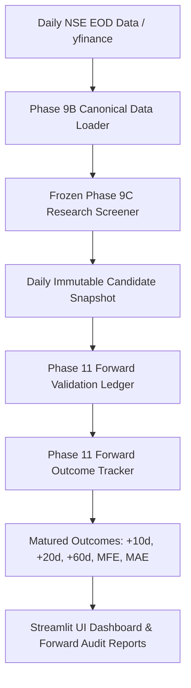
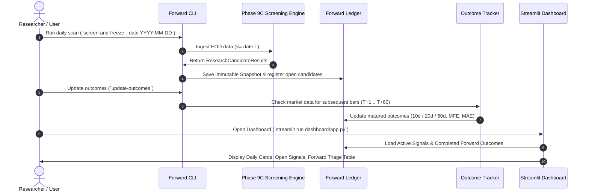

# Phase 11 Implementation Plan: Live / Paper Forward Validation Engine

> **MANDATORY PRINCIPLE — NO RETROACTIVE MODIFICATION / STRICT TEMPORAL IMMUTABILITY**
> Forward validation measures whether the frozen analytical engine continues to produce useful triage outcomes prospectively on real-world market data. Every candidate snapshot is permanently frozen at screening timestamp $T$. Future prices must NEVER influence historical candidate attributes, and historical candidate signals must NEVER be retroactively modified or deleted.

---

## 1. Executive Overview & Mission

### Primary Objective:
Build an automated, point-in-time safe **Live / Paper Forward Validation Engine** for the Wyckoff Stock Screener that:
1. Executes prospective daily screening scans on active NSE equity universe data using the **frozen Phase 8/9C Research Engine**.
2. Permanently freezes each candidate record into an **immutable Forward Validation Ledger** at date $T$.
3. Automatically tracks subsequent market price action as new trading days occur, calculating realized **10-day, 20-day, and 60-day forward returns**, **MFE**, and **MAE** once horizons mature.
4. Generates cumulative forward triage audit reports comparing candidate cohorts (`HIGH_PRIORITY`, `QUALIFIED`, `WATCHLIST`, `DISQUALIFIED`) against the unselected universe baseline.
5. Exposes the prospective tracking ledger and performance metrics in the **Streamlit Research Dashboard**.

---

## 2. Frozen Components (Strictly Unchanged)

The following analytical engines and parameters remain **completely frozen**:
- **Wyckoff Event Detectors**: SC, AR, ST, Spring, LPS, SOS, UTAD (`src/wyckoff_screener/wyckoff/`)
- **VSA Formulas & Thresholds**: Volume ratios, spread ratios, close positions, stopping volume, no demand/supply (`src/wyckoff_screener/indicators/vsa.py`)
- **Point & Figure Engine**: 3-box reversal construction & count objective formulas (`src/wyckoff_screener/pointfigure/`)
- **Mechanical Filters & Setup Scorer**: 3-gate trend/momentum/volatility contraction filters and scoring weights (30% Mechanical, 40% Event, 20% Peer, 10% P&F) (`src/wyckoff_screener/scoring/`)
- **Candidate Categorization Precedence**: `DISQUALIFIED` $\rightarrow$ `HIGH_PRIORITY` ($\ge 60$ + LPS/SOS/Spring) $\rightarrow$ `QUALIFIED` ($\ge 40$) $\rightarrow$ `WATCHLIST` $\rightarrow$ `NO_SETUP` (`src/wyckoff_screener/research/screening_engine.py`)
- **Phase 9A/9B Schemas & Phase 10 Validation Engine**: Existing historical validation modules remain unchanged.

---

## 3. Existing Architecture & Reusable Components



### Reusable Production Modules:
1. `src/wyckoff_screener/research/screening_engine.py`: Evaluates universe data and produces `ResearchCandidateResult` records with full numeric evidence.
2. `src/wyckoff_screener/data_loader.py`: Enforces OHLC geometry validation and chronological sorting.
3. `src/wyckoff_screener/validation/metrics.py`: Standardized forward return and MFE/MAE calculation algorithms.
4. `src/wyckoff_screener/charting/tradingview_links.py`: Generates multi-timeframe review URLs for human inspection.
5. `dashboard/app.py`: Streamlit multi-page interface.

---

## 4. Proposed Phase 11 Forward Validation Architecture

We will create a dedicated, isolated package: `src/wyckoff_screener/forward/`.

```
src/wyckoff_screener/forward/
├── __init__.py
├── models.py          # Data structures: ForwardCandidateRecord, ForwardOutcomeRecord, ForwardLedgerManifest
├── ledger.py          # Persistent forward ledger: append-only snapshots, deduplication, JSON/CSV storage
├── tracker.py         # Forward price-path tracker: checks bar maturity, computes realized return/MFE/MAE
└── cli.py             # CLI commands: screen-and-freeze, update-outcomes, forward-report
```

### 4.1 Data Models (`src/wyckoff_screener/forward/models.py`)

#### `ForwardCandidateRecord` (Immutable Snapshot at Date $T$):
```python
@dataclass(frozen=True)
class ForwardCandidateRecord:
    # 1. Provenance & Identity
    candidate_id: str                 # Deterministic hash: SHA256(symbol + screening_date + engine_version)[:16]
    screening_date: str               # YYYY-MM-DD
    symbol: str                       # e.g. "ANANTRAJ"
    yfinance_ticker: str              # e.g. "ANANTRAJ.NS"
    company_name: str                 # e.g. "Anant Raj Limited"
    reference_close_price: float      # Close price at date T (entry anchor for returns)

    # 2. Frozen Triage Categorization
    candidate_category: str           # HIGH_PRIORITY_CANDIDATE, QUALIFIED_CANDIDATE, WATCHLIST, DISQUALIFIED
    composite_score: float            # 0.0 - 100.0
    is_mechanically_qualified: bool   # True / False
    is_disqualified: bool             # True / False
    disqualifying_flags: list[str]    # Specific flags

    # 3. Frozen Wyckoff & VSA Evidence
    most_recent_event_type: Optional[str]
    most_recent_event_date: Optional[str]
    vsa_volume_ratio: float
    vsa_spread_ratio: float
    vsa_close_position: float
    pf_target_price: Optional[float]
    pf_upside_pct: Optional[float]
    explanation_summary: str

    # 4. Engine Metadata
    engine_version: str               # "1.0.0"
    created_at_utc: str               # ISO timestamp
```

#### `ForwardOutcomeRecord` (Prospective Realized Performance):
```python
@dataclass
class ForwardOutcomeRecord:
    candidate_id: str
    symbol: str
    screening_date: str
    reference_close_price: float
    candidate_category: str
    composite_score: float

    # Tracking Status
    available_forward_bars: int       # Number of trading sessions observed after T
    status_10d: str                   # "PENDING" or "MATURED"
    status_20d: str                   # "PENDING" or "MATURED"
    status_60d: str                   # "PENDING" or "MATURED"

    # Realized Forward Outcomes
    fwd_ret_10d: Optional[float]      # Realized % return at bar T+10
    fwd_ret_20d: Optional[float]      # Realized % return at bar T+20
    fwd_ret_60d: Optional[float]      # Realized % return at bar T+60

    # Excursion Path Metrics
    mfe_10d: Optional[float]
    mae_10d: Optional[float]
    mfe_20d: Optional[float]
    mae_20d: Optional[float]
    mfe_60d: Optional[float]
    mae_60d: Optional[float]

    last_updated_date: str
```

---

## 5. Point-in-Time Safeguards & Anti-Leakage Design

1. **Strict Temporal Slicing**: When running prospective screening at date $T$, market data is restricted to `df[df["Date"] <= T]`.
2. **Immutable Snapshot Ledger**: Screening snapshots are saved to `data/forward_validation/snapshots/snapshot_YYYYMMDD.json`. Once written, snapshot files are read-only and never modified.
3. **Dedicated Outcome Ledger**: Realized forward returns are written to `data/forward_validation/ledger/forward_outcomes.csv`. Outcomes are updated only when future market data actually arrives (i.e. `available_forward_bars >= 10`, `20`, or `60`).
4. **Zero Lookahead Guarantee**: The outcome tracker evaluates forward returns strictly on bars `[T+1 : T+H]`. It never modifies the original `reference_close_price` or candidate attributes.

---

## 6. Daily Screening & Forward Tracking Workflow



### CLI Command Interfaces (`src/wyckoff_screener/forward/cli.py`):
- `python -m wyckoff_screener.forward screen --date YYYY-MM-DD`: Runs prospective screening, freezes snapshot, registers candidates into ledger.
- `python -m wyckoff_screener.forward update`: Fetches latest price data, updates matured 10d/20d/60d forward returns for all open candidates.
- `python -m wyckoff_screener.forward report`: Prints forward validation performance summary across cohorts.

---

## 7. Streamlit Dashboard Integration

Enhance `dashboard/app.py` by adding a 4th tab: **"🔮 Forward Paper Validation"**:
1. **Active Forward Watchlist**: Displays open candidate setups generated within the last 60 trading days with real-time unrealized P&L and current bar age.
2. **Matured Outcomes Ledger**: Interactive table of completed 10d, 20d, and 60d forward trades with win rates, MFE, and MAE.
3. **Forward vs. Historical Triage Comparison**: Side-by-side comparison table validating whether prospective forward win rates and returns match historical Phase 10 validation findings.

---

## 8. Test Plan

We will create dedicated unit and integration tests in `tests/forward/`:

| Test Module | Test Case | Scope & Verification |
| :--- | :--- | :--- |
| `test_forward_models.py` | `test_candidate_id_determinism` | Verifies candidate IDs are deterministic hashes. |
| `test_forward_ledger.py` | `test_immutable_snapshot_persistence` | Verifies screening snapshots are saved and cannot be overwritten. |
| `test_forward_ledger.py` | `test_duplicate_screening_rejection` | Verifies running screening twice on same date does not duplicate records. |
| `test_forward_tracker.py` | `test_partial_horizon_handling` | Verifies bars with <10 days remain `PENDING` with null return. |
| `test_forward_tracker.py` | `test_matured_horizon_calculation` | Verifies exact calculation of +10d, +20d, +60d return and MFE/MAE when bars mature. |
| `test_forward_tracker.py` | `test_zero_lookahead_forward_isolation` | Verifies modifying future prices does not alter the frozen screening snapshot. |

---

## 9. Risks, Limitations & Safeguards

- **Risk**: Missing daily EOD data or API fetch failures from Yahoo Finance.
  - **Safeguard**: Resilient batch fetcher with fallback caching and explicit error reporting.
- **Risk**: Premature outcome calculation on partial trading weeks.
  - **Safeguard**: Strict bar count checking (`len(forward_bars) >= horizon`) before updating status to `MATURED`.
- **Risk**: Conflating prospective paper validation with live trading.
  - **Safeguard**: Prominent disclaimers across all reports and UI views that forward validation is a research triage tool without order execution.

---

## 10. Summary of File Modifications

### New Files to Create:
- `src/wyckoff_screener/forward/__init__.py`
- `src/wyckoff_screener/forward/models.py`
- `src/wyckoff_screener/forward/ledger.py`
- `src/wyckoff_screener/forward/tracker.py`
- `src/wyckoff_screener/forward/cli.py`
- `src/wyckoff_screener/forward/__main__.py`
- `tests/forward/__init__.py`
- `tests/forward/test_forward_ledger.py`
- `tests/forward/test_forward_tracker.py`
- `docs/FORWARD_VALIDATION.md`

### Existing Files to Update:
- `dashboard/app.py` (Add Forward Paper Validation page tab)
- `PROGRESS.md` (Record Phase 11 milestone)
- `README.md` (Add Phase 11 forward validation usage instructions)

### Files Intentionally NOT Changed:
- **Zero changes** to `src/wyckoff_screener/wyckoff/`
- **Zero changes** to `src/wyckoff_screener/indicators/`
- **Zero changes** to `src/wyckoff_screener/scoring/`
- **Zero changes** to `src/wyckoff_screener/pointfigure/`
- **Zero changes** to `src/wyckoff_screener/validation/`
