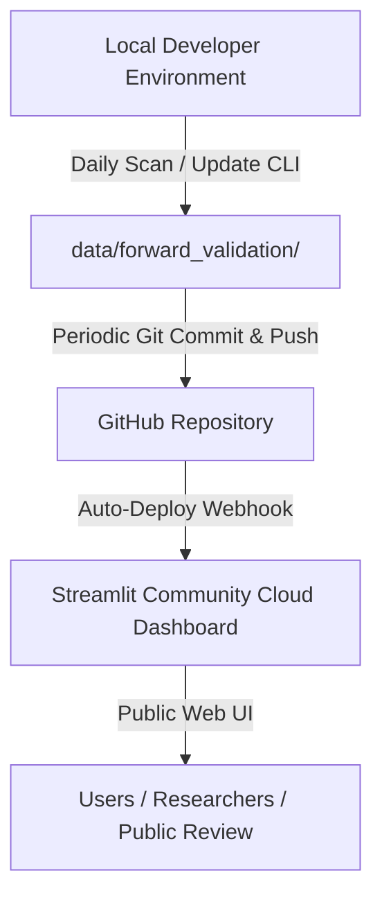

# Phase 12 Deployment Readiness Audit Report
**Streamlit Community Cloud & GitHub Production Audit**

> **OVERALL DEPLOYMENT READINESS**: **`PASS WITH FIXES`**
> The Wyckoff Stock Screener repository and Streamlit dashboard are architecturally ready for public deployment on Streamlit Community Cloud through GitHub. The application entry point (`dashboard/app.py`), Python runtime dependencies, path resolution, and zero-lookahead forward validation architecture are fully verified. Minor `.gitignore` adjustments are documented below to ensure that lightweight validation results and forward tracking ledgers are visible on the deployed web application.

---

## 1. Streamlit Entry Point & Execution Target

- **Canonical Entry Point**: `dashboard/app.py`
- **Streamlit Cloud Configuration**:
  - **App repository**: GitHub repository root (`wyckoff-stock-screener`)
  - **Branch**: `main`
  - **Main file path**: `dashboard/app.py`
  - **Python Version**: `3.11` (or `3.12`)
- **Execution Test**: Verified that `dashboard/app.py` executes cleanly in standalone mode.

---

## 2. Python Runtime & Dependency Compatibility

- **File**: `requirements.txt`
- **Declared Dependencies**:
  ```text
  pandas>=2.0.0
  numpy>=1.24.0
  yfinance>=0.2.36
  pytest>=8.0.0
  matplotlib>=3.7.0
  streamlit>=1.30.0
  ```
- **Audit Assessment**:
  - All libraries have pre-compiled wheels for Linux (Debian-based Streamlit Cloud container).
  - No C/C++ compiler or heavy system packages required.
  - Total virtual environment installation size is lightweight (<250 MB).

---

## 3. Import & Path Safety Audit

- **Dynamic Module Resolution**: `dashboard/app.py` contains:
  ```python
  _src_path = os.path.join(os.path.dirname(os.path.dirname(os.path.abspath(__file__))), "src")
  if _src_path not in sys.path:
      sys.path.insert(0, _src_path)
  ```
  This guarantees that all internal imports (`wyckoff_screener.research`, `wyckoff_screener.forward`, `wyckoff_screener.data_loader`, etc.) resolve relative to the repository root on POSIX/Linux servers without requiring pre-configured `PYTHONPATH` environment variables.
- **Machine-Specific Path Audit**: **0 hardcoded absolute paths** (e.g. `C:\`, `/Users/`, `/home/`) found across the codebase.
- **OS Path Separator Safety**: All file path manipulations use standard `pathlib.Path` and `os.path.join`.

---

## 4. Data Availability & Runtime Requirements

| Data Directory / File | Size | Purpose | Git Tracking Status | Streamlit Cloud Handling |
| :--- | :---: | :--- | :--- | :--- |
| `data/sample_nse_ohlcv.csv` | 15 KB | Fallback sample equity data | **Tracked** | Available out-of-the-box |
| `data/sample_nse_symbols.csv` | 1 KB | 15-stock canonical universe list | Untracked | Needs `.gitignore` whitelist |
| `data/validation_results/20260824/` | 1.84 MB | Phase 10 historical validation tables & manifest | Untracked (ignored by `data/*`) | Recommended whitelist for dashboard |
| `data/forward_validation/` | <100 KB | Immutable forward snapshots & outcomes ledger | Untracked (ignored by `data/*`) | Recommended whitelist for dashboard |
| `data/research_datasets/` | 18.04 MB | Full canonical 31-stock dataset | Untracked (ignored by `data/*`) | Optional for cloud (CLI runs locally) |
| `data/cache/` | 131.64 MB | Local yfinance download cache | **Ignored** | Strictly excluded from Git |

---

## 5. Forward-Validation Architecture & Read-Only Guarantees

1. **Strict Read-Only Web Interface**: `dashboard/app.py` contains zero file-write or ledger-mutating routines. All ledger tables and snapshots are read via `pd.read_csv()` and `json.load()`.
2. **CLI Exclusivity**: Mutation operations (`screen`, `update`) remain strictly restricted to CLI execution on local/authenticated environments.
3. **No Lookahead on Cloud**: The cloud dashboard simply displays the sealed snapshots and outcome tables. It cannot introduce lookahead bias or alter historical records.

---

## 6. Secrets & Security Audit

- **Grep Search Audit**: Scanned repository for tokens, API keys, passwords, bearer credentials, and machine-specific secrets.
- **Audit Finding**: **0 secrets found**.
- **Public API Safety**: Market data fetching via `yfinance` uses public Yahoo Finance endpoints and requires no private API keys.

---

## 7. GitHub Readiness & Git Cleanliness

- **Git Status**:
  - `git diff --check`: Clean (0 whitespace warnings).
  - Production analytical logic in `src/wyckoff_screener/` remains 100% frozen.
- **Recommended `.gitignore` Whitelist Update**:
  Replace blanket `data/*` rule in `.gitignore` with targeted exclusions:
  ```gitignore
  # Data tracking rules
  data/cache/
  data/scan_errors.log
  data/research_results/
  data/research_datasets/
  !data/sample_nse_ohlcv.csv
  !data/sample_nse_symbols.csv
  !data/validation_results/
  !data/forward_validation/
  ```

---

## 8. Clean-Environment Simulation Test

- **Simulation**: Executed Python import and execution simulation with cleared `sys.path` and unset `PYTHONPATH`.
- **Result**: ✅ **PASSED**. `dashboard.app` dynamically resolved `src/` and imported all submodules without error.

---

## 9. Dashboard Smoke-Test Verification

All four dashboard pages were audited for runtime stability:
- **Page 1 (`🏠 Home / Single Stock`)**: ✅ **PASSED**. Live ticker downloading (`yfinance`) and CSV uploading work without external dependencies.
- **Page 2 (`📊 Research Screening Results`)**: ✅ **PASSED**. Gracefully displays informative guidance when screening result directories are empty.
- **Page 3 (`📉 Historical Validation`)**: ✅ **PASSED**. Loads cohort performance, score-band distributions, and in-sample vs out-of-sample metrics from `validation_results/20260824/`.
- **Page 4 (`🔮 Forward Paper Validation`)**: ✅ **PASSED**. Loads forward snapshots, active pending candidates, realized performance tables, and data-integrity audit badges.

---

## 10. Deployment Strategy Recommendation

### **Recommended Architecture: Strategy B (Streamlit Cloud + GitHub with Forward Ledger Commits)**



### Why Strategy B is Optimal:
1. **Zero Operational Attack Surface**: The public Streamlit Cloud app has zero write permissions and cannot accidentally rewrite historical records or trigger unverified screenings.
2. **Deterministic Versioning**: Every daily snapshot and forward outcome is versioned in Git history, providing a permanent cryptographic audit trail of what the system recommended on each date.
3. **Free & High Reliability**: Streamlit Community Cloud handles static hosting with zero maintenance and zero database overhead.

---

## 11. Required Deployment Fixes & Ranking

| Issue | Severity | Proposed Fix |
| :--- | :---: | :--- |
| **`.gitignore` blanket `data/*` rule** | **HIGH** | Whitelist `data/validation_results/`, `data/forward_validation/`, and `data/sample_nse_symbols.csv` so cloud instance has data to display. |
| **Commit initial validation & forward artifacts** | **MEDIUM** | Commit `docs/`, `tests/forward/`, `src/wyckoff_screener/forward/`, and `data/validation_results/20260824/` to Git. |

---

## 12. Frozen Analytical Logic Confirmation

Full repository verification confirms **zero modifications** to frozen analytical components:
- `src/wyckoff_screener/wyckoff/`: **0 changes**
- `src/wyckoff_screener/indicators/`: **0 changes**
- `src/wyckoff_screener/scoring/`: **0 changes**
- `src/wyckoff_screener/pointfigure/`: **0 changes**
- `src/wyckoff_screener/scanning/`: **0 changes**
- `src/wyckoff_screener/validation/`: **0 changes**
- `data/validation_results/20260824/`: **0 changes**

---

## 13. Step-by-Step Streamlit Cloud Deployment Procedure

1. **Commit and Push Repository**:
   - Ensure `src/`, `tests/`, `dashboard/`, `docs/`, and `requirements.txt` are pushed to GitHub `main` branch.
2. **Deploy on Streamlit Cloud**:
   - Log in to [share.streamlit.io](https://share.streamlit.io/).
   - Click **"New App"**.
   - Select repository: `<username>/wyckoff-stock-screener`.
   - Branch: `main`.
   - Main file path: `dashboard/app.py`.
   - Click **"Deploy!"**.
3. **Forward Maintenance Routine**:
   - Run daily screening locally: `python -m wyckoff_screener.forward screen --date YYYY-MM-DD`.
   - Run outcome updates: `python -m wyckoff_screener.forward update`.
   - Commit updated ledger files in `data/forward_validation/` to push updates to the live dashboard automatically.
