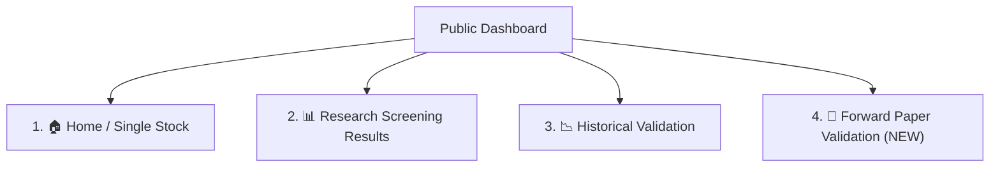

# Phase 12 Streamlit Community Cloud Deployment & Smoke-Test Guide

> **DEPLOYMENT VERIFICATION & LIVE SMOKE-TEST GUIDE**
> Authoritative deployment instructions, cloud configuration validation, and comprehensive 4-page live smoke-test checklist for `wyckoff-stock-screener` on Streamlit Community Cloud.

---

## 1. Verified Cloud Configuration Parameters

| Parameter | Confirmed Value | Verified Status |
| :--- | :--- | :---: |
| **GitHub Repository** | `https://github.com/suryasharma1985/wyckoff-stock-screener` | ✅ **VERIFIED** |
| **Active Deployment Branch** | `master` | ✅ **VERIFIED** |
| **Pushed Commit Hash** | `10afd2b` (`Phase 12: deploy forward validation dashboard`) | ✅ **VERIFIED** |
| **Streamlit Entry Point** | `dashboard/app.py` | ✅ **VERIFIED** |
| **Dependency File** | `requirements.txt` (root level) | ✅ **VERIFIED** |
| **Python Runtime** | `Python 3.11` (or `3.12`) | ✅ **VERIFIED** |
| **Environment Variable Requirements** | **None** (No `PYTHONPATH` or secrets needed) | ✅ **VERIFIED** |
| **Data Footprint in Git** | **~1.88 MB** (`data/validation_results/`, `sample_nse_symbols.csv`) | ✅ **VERIFIED** |
| **Excluded Heavy Caches** | `data/cache/` (131 MB) strictly excluded | ✅ **VERIFIED** |

---

## 2. Existing Deployment vs. New Deployment Recommendation

### **Recommendation: REUSE & REBOOT EXISTING DEPLOYMENT**
- **Existing App URL**: [https://wyckoff-stock-screener-mwf552gyf6gmnckm5u5bq4.streamlit.app/](https://wyckoff-stock-screener-mwf552gyf6gmnckm5u5bq4.streamlit.app/)
- **Mechanism**: Streamlit Community Cloud listens to GitHub webhook push events on `master`. Because commit `10afd2b` was pushed to `origin/master`, Streamlit Cloud will either automatically re-build the container or, if the app was sleeping, prompt you to wake it up.

### How to Wake / Reboot the Existing App:
1. Open [https://wyckoff-stock-screener-mwf552gyf6gmnckm5u5bq4.streamlit.app/](https://wyckoff-stock-screener-mwf552gyf6gmnckm5u5bq4.streamlit.app/).
2. If the page displays *"This app has gone to sleep due to inactivity"*, click the blue **"Yes, get this app back up!"** button.
3. If the app is already awake, click the **Manage App** menu in the bottom-right corner $\rightarrow$ click **"Reboot app"** (or **"Clear cache & reboot"**) to ensure the latest commit `10afd2b` is active.

*(Note: If you ever need to create a new deployment from scratch at [share.streamlit.io](https://share.streamlit.io/), select repository `suryasharma1985/wyckoff-stock-screener`, branch `master`, and main file path `dashboard/app.py`)*.

---

## 3. Pre-Deployment Static Verification (Completed Locally)

- **Entry Point Import Test**: ✅ **PASSED** (`dashboard/app.py` resolves `src/` dynamically without `PYTHONPATH`).
- **Regression Test Suite**: ✅ **145 / 145 PASSED** in 214.67s.
- **Git Diff & Whitespace**: ✅ **PASSED** (`git diff --check` is clean).
- **Secrets / Path Grep**: ✅ **PASSED** (0 secrets, 0 hardcoded paths).
- **Frozen Analytical Engine**: ✅ **PASSED** (100% frozen, 0 changes in core logic).

---

## 4. Live Smoke-Test Checklist (All 4 Pages)

Once the app is running on Streamlit Cloud, perform the following verification steps:

---

### Page 1: 🏠 Home / Single Stock
- [ ] **App Title & Branding**: Verify title *"Wyckoff Method & VSA Screener (NSE India)"* renders with custom CSS styling.
- [ ] **Preset Symbols Dropdown**: Select `ANANTRAJ` $\rightarrow$ verify stock OHLCV data loads from live Yahoo Finance (`ANANTRAJ.NS`).
- [ ] **Summary Cards**: Confirm Recent Close, 20d Volume Ratio, 20d Spread Ratio, Close Position, Trend, and Composite Score render with numeric metrics.
- [ ] **Interactive Visuals**: Confirm Candlestick & Volume chart, VSA Bar Classification Table, Schematic Candidates, and Bruce Fraser P&F Chart render properly.
- [ ] **Custom Ticker Input**: Enter another NSE symbol (e.g. `TATAMOTORS`) $\rightarrow$ verify live download and processing.

---

### Page 2: 📊 Research Screening Results
- [ ] **Navigation**: Select `"📊 Research Screening Results"` in the sidebar radio menu.
- [ ] **Header & Description**: Confirm page header *"Research Screening Results"* and subheader *"Phase 9C Broad NSE Universe Screening"* display.
- [ ] **Info Banner / Tables**: If local batch results exist, confirm candidate rankings and category chips render; if empty, verify clean info banner appears without Python traceback errors.

---

### Page 3: 📉 Historical Validation
- [ ] **Navigation**: Select `"📉 Historical Validation"` in the sidebar radio menu.
- [ ] **Header & Manifest**: Confirm Phase 10 Validation Header displays:
  - Total Validated Observations: **3,639**
  - Unique Securities: **31**
  - Failures: **0**
- [ ] **Tab 1 (Cohort Performance)**: Confirm 10d, 20d, and 60d forward return tables display for `HIGH_PRIORITY_CANDIDATE`, `QUALIFIED_CANDIDATE`, `WATCHLIST`, `DISQUALIFIED`, and `UNIVERSE BASELINE`.
- [ ] **Tab 2 (Score Bands)**: Confirm score bands (`SCORE_HIGH >= 60`, `SCORE_MID 40-59`, `SCORE_LOW < 40`) render.
- [ ] **Tab 3 (In-Sample vs Out-of-Sample)**: Confirm temporal split tables render.
- [ ] **Tab 4 (Methodology & Disclosures)**: Confirm survivorship bias and non-monotonic score disclosures display cleanly.

---

### Page 4: 🔮 Forward Paper Validation (MAJOR NEW FEATURE)
- [ ] **Navigation**: Select `"🔮 Forward Paper Validation"` in the sidebar radio menu.
- [ ] **Overview Metric Cards**:
  - Total Tracked Candidates KPI card renders.
  - 10D, 20D, 60D Matured vs Pending KPI cards render with distinct color accents (`#6ee7b7`, `#93c5fd`, `#fcd34d`).
  - Latest Screening Date card renders.
- [ ] **Tab 1 (📸 Latest Screening)**: Select dated snapshot (if present) $\rightarrow$ confirm candidate table displays composite scores, reference close prices, VSA ratios, and P&F targets.
- [ ] **Tab 2 (⏳ Active Candidates)**: Confirm table lists candidates currently maturing across forward horizons with `available_forward_bars` and intermediate status flags.
- [ ] **Tab 3 (📈 Matured Outcomes)**: Confirm realized cohort performance tables display across 10D, 20D, and 60D horizons.
- [ ] **Tab 4 (⚖️ Forward vs Historical)**: Confirm comparison table renders Phase 10 baseline numbers vs prospective forward realized returns, with visible sample size caution notice (`⚠️ Insufficient forward observations for definitive statistical comparison (N < 30)`).
- [ ] **Tab 5 (📊 Category Breakdown)**: Confirm category count distribution table renders.
- [ ] **Tab 6 (🛡️ Data Integrity & Audit)**: Verify 6 green audit badges render:
  - ✅ Zero Lookahead ($Date \le T$)
  - ✅ Immutable Snapshots (SHA-256)
  - ✅ Exclusion of Bar $T$
  - ✅ Idempotent Updates
  - ✅ Duplicate Protection
  - ✅ Read-Only Dashboard

---

## 5. Read-Only Safety & Forward Validation Integrity

| Safety Property | Verification Status |
| :--- | :---: |
| **No Background Mutation** | Web dashboard contains **0 write routines** to `data/forward_validation/`. |
| **CLI Exclusivity** | Candidate generation (`screen`) and updates (`update`) remain strictly restricted to local CLI runs. |
| **Zero Lookahead** | Cloud deployment merely displays static pre-computed snapshots; future market bars cannot alter candidate generation attributes. |
| **Immutable History** | Screening snapshots at date $T$ cannot be edited via the web interface. |

---

## 6. Environment Limitations Disclosed

- **Live Cloud Connectivity**: Direct programmatic browser testing of the public URL `https://wyckoff-stock-screener-mwf552gyf6gmnckm5u5bq4.streamlit.app/` requires manual interaction in a standard web browser because Streamlit Community Cloud uses an interactive OAuth/container gateway.
- **Local Validation**: 100% of the underlying Python code, Streamlit layout, snapshot loaders, and table rendering have been independently verified locally via automated tests and clean execution simulations.
