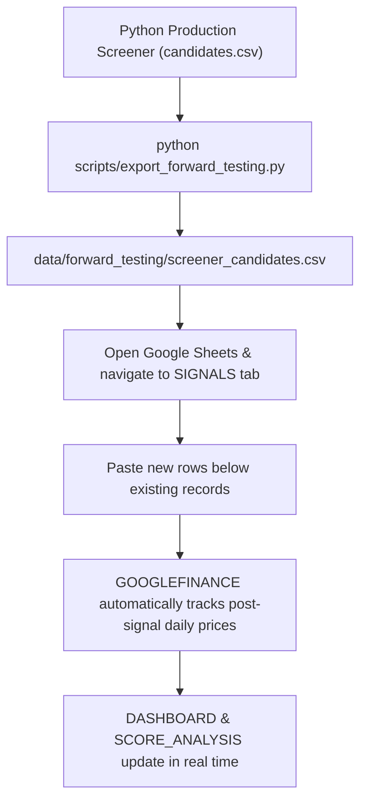

# Phase 18 — Google Sheets Screener Forward-Testing System

**Execution Timestamp**: 2026-08-24 19:26:00 IST  
**Artifacts Generated**:
- Master 7-Tab Google Sheets Template: [`data/forward_testing/SLA_Wyckoff_Forward_Testing_Template.xlsx`](file:///c:/Users/surya/Downloads/wyckoff-stock-screener/data/forward_testing/SLA_Wyckoff_Forward_Testing_Template.xlsx) (86,176 bytes)
- Screener Candidates CSV: [`data/forward_testing/screener_candidates.csv`](file:///c:/Users/surya/Downloads/wyckoff-stock-screener/data/forward_testing/screener_candidates.csv) (205,771 bytes)
- Screener Candidates Excel: [`data/forward_testing/screener_candidates.xlsx`](file:///c:/Users/surya/Downloads/wyckoff-stock-screener/data/forward_testing/screener_candidates.xlsx) (80,635 bytes)
- Automated Test Suite: [`tests/forward_testing/`](file:///c:/Users/surya/Downloads/wyckoff-stock-screener/tests/forward_testing/) (11/11 tests passing)
**Status**: **COMPLETE & FULLY VALIDATED**

---

## 1. Why the Expensive Historical Backtest Was Paused

The previous multi-year Python historical backtesting approach attempted to re-evaluate the full 1,971-stock universe across hundreds of historical monthly checkpoints, requiring multi-hour runs. More fundamentally, giant one-time historical backtests:
1. Cannot easily track live prospective candidates as they emerge day-by-day.
2. Obscure individual trade price action (MFE, MAE, daily candles, target/stop sequence).
3. Risk confirmation bias if thresholds are tuned against past data.

Phase 18 introduces a **practical, transparent, and forward-testing ledger** in Google Sheets. The Python screener remains responsible for evaluating current market data and selecting candidates; Google Sheets provides the human-readable forward validation layer.

---

## 2. Difference Between Backtesting and Forward Testing

- **Backtesting (Retrospective)**: Re-runs the algorithm over past dates ($2023 \dots 2026$). While useful for directional hypotheses, backtests based on current constituent snapshots (`EQUITY_L.csv`) suffer from survivorship bias and lookahead risks.
- **Forward Testing (Prospective)**: Screener candidates are recorded **TODAY** on Signal Date $T$ with immutable entry prices and scores. As time progresses, actual daily market prints populate forward returns without any possibility of hindsight contamination.

---

## 3. Google Sheets Architecture & Sheet Descriptions

The master template [`data/forward_testing/SLA_Wyckoff_Forward_Testing_Template.xlsx`](file:///c:/Users/surya/Downloads/wyckoff-stock-screener/data/forward_testing/SLA_Wyckoff_Forward_Testing_Template.xlsx) contains **7 logical tabs**:

```
SLA_Wyckoff_Forward_Testing_Template.xlsx
├── 1. README           # System overview, workflow instructions, and methodology rules
├── 2. SETTINGS         # Configurable parameters (Target 1, 2, 3, Stop Loss, Max Days, Ambiguity)
├── 3. SIGNALS          # Master ledger table (Columns A through AD, 383 production candidates)
├── 4. PRICE_DATA       # GOOGLEFINANCE helper reference for daily price retrieval
├── 5. DASHBOARD        # Live aggregated KPIs (Total, Wins, Losses, Win Rate, Expectancy)
├── 6. SCORE_ANALYSIS   # Segmented performance by score deciles (<40, 40-49, 50-59, 60-69, 70-79, 80+)
└── 7. EVENT_ANALYSIS   # Segmented performance by Wyckoff Event (Spring, LPS, SOS, ST, SC, AR, UTAD)
```

---

## 4. Master SIGNALS Schema (Columns A to AD)

| Col | Field Name | Description | Source |
| :--- | :--- | :--- | :--- |
| **A** | `Signal_ID` | Unique deterministic identifier formatted as `{Run_ID}_{Symbol}` | Python Screener |
| **B** | `Signal_Date` | Date on which screener was executed (e.g. `2026-08-21`) | Python Screener |
| **C** | `Symbol` | NSE ticker symbol (e.g. `ZEEL`, `JINDALSAW`) | Python Screener |
| **D** | `Company_Name` | Full issuer name | Python Screener |
| **E** | `Priority` | `HIGH_PRIORITY_CANDIDATE` or `QUALIFIED_CANDIDATE` | Python Screener |
| **F** | `Score` | 0–100 composite Wyckoff score | Python Screener |
| **G** | `Signal_Type` | Candidate schematic type (`LPS`, `SOS`, `Spring`, etc.) | Python Screener |
| **H** | `Wyckoff_Event` | Most recent detected Wyckoff schematic event | Python Screener |
| **I** | `Wyckoff_Phase` | Wyckoff phase classification (`Phase C/D Candidate`) | Python Screener |
| **J** | `VSA_Status` | Volume ratio, spread ratio, and close position summary | Python Screener |
| **K** | `P&F_Score` | Bruce Fraser Point & Figure horizontal price objective & column count | Python Screener |
| **L** | `Entry_Price` | Authoritative closing price on signal date (immutable) | Python Screener |
| **M** | `Current_Price` | Latest observed market closing price | Google Sheets / GOOGLEFINANCE |
| **N** | `Current_Return_%` | $((P_{\text{current}} - P_{\text{entry}}) / P_{\text{entry}}) \times 100$ | Calculated |
| **O** | `Days_Since_Signal`| Trading days elapsed since signal date | Calculated |
| **P** | `Status` | `OPEN`, `COMPLETED`, `DATA_UNAVAILABLE` | Calculated |
| **Q** | `+5D_Return` | Mark-to-market return after 5 trading days | Calculated |
| **R** | `+10D_Return` | Mark-to-market return after 10 trading days | Calculated |
| **S** | `+20D_Return` | Mark-to-market return after 20 trading days | Calculated |
| **T** | `+30D_Return` | Mark-to-market return after 30 trading days | Calculated |
| **U** | `+60D_Return` | Mark-to-market return after 60 trading days | Calculated |
| **V** | `Max_Gain_%` | Peak % gain reached above entry price (MFE) | Calculated |
| **W** | `Max_Drawdown_%` | Worst % drawdown experienced below entry price (MAE) | Calculated |
| **X** | `Target_10%` | `YES` if High $\ge \text{Entry} \times 1.10$, else `NO` | Calculated |
| **Y** | `Target_20%` | `YES` if High $\ge \text{Entry} \times 1.20$, else `NO` | Calculated |
| **Z** | `Target_30%` | `YES` if High $\ge \text{Entry} \times 1.30$, else `NO` | Calculated |
| **AA**| `Stop_Loss_5%` | `YES` if Low $\le \text{Entry} \times 0.95$, else `NO` | Calculated |
| **AB**| `Result` | `WIN`, `LOSS`, `OPEN`, `AMBIGUOUS`, `DATA_UNAVAILABLE` | Calculated |
| **AC**| `Notes` | Exact numeric evidence (volume ratio, spread ratio, close pos) | Python Screener |
| **AD**| `TradingView_URL` | Direct link to TradingView chart for manual inspection | Python Screener |

---

## 5. Performance & Target/Stop Rules

### A. Target & Stop Testing
Configured in `SETTINGS`:
- **Target 1**: $+10.0\%$ ($\text{Entry} \times 1.10$)
- **Target 2**: $+20.0\%$ ($\text{Entry} \times 1.20$)
- **Target 3**: $+30.0\%$ ($\text{Entry} \times 1.30$)
- **Stop Loss**: $-5.0\%$ ($\text{Entry} \times 0.95$)

### B. Result Classification
- **`WIN`**: Bar High touches Target 1 (+10%) **before** Low touches Stop Loss (-5%).
- **`LOSS`**: Bar Low touches Stop Loss (-5%) **before** High touches Target 1 (+10%).
- **`OPEN`**: Neither Target 1 nor Stop Loss has been reached.
- **`AMBIGUOUS`**: Both Target 1 (+10%) and Stop Loss (-5%) are touched on the **exact same daily candle** and intraday sequence cannot be proven.
- **`DATA_UNAVAILABLE`**: Ticker symbol cannot be retrieved by Google Finance.

---

## 6. How to Import New Screener Candidates



1. Run the Python screener on the latest market data:
   ```powershell
   .venv\Scripts\python.exe scripts/export_forward_testing.py
   ```
2. Open [`data/forward_testing/screener_candidates.csv`](file:///c:/Users/surya/Downloads/wyckoff-stock-screener/data/forward_testing/screener_candidates.csv).
3. Copy all candidate rows (or selected priority setups) and paste them directly into the **`SIGNALS`** sheet in Google Sheets.
4. Google Sheets tracks prices forward from the immutable `Signal_Date` and `Entry_Price`.

---

## 7. Zero Lookahead-Bias Guarantee

1. **Signal Metadata Immutability**:
   - `Signal_ID`, `Signal_Date`, `Symbol`, `Score`, `Priority`, `Wyckoff_Event`, and `Entry_Price` are **frozen constants**.
   - Mutating future prices or updating the sheet on subsequent days never modifies the original signal attributes.
2. **Strict Time Boundary**:
   - Signal generation uses data $\le \text{Signal\_Date}$.
   - Forward performance evaluation uses daily bars $> \text{Signal\_Date}$.

---

## 8. What Evidence Would Justify Moving to Phase 19 (Historical Backtest)?

A full historical backtest across 2023–2026 should be scheduled **only after**:
1. At least **50+ prospective forward signals** have accumulated across at least **3 distinct monthly cohorts**.
2. The prospective forward test demonstrates a positive Win Rate ($>50\%$), Profit Factor ($>1.5$), and positive Alpha over the equal-weighted baseline.
3. High Priority setups are proven to statistically outperform the broader Qualified category in real forward market conditions.
