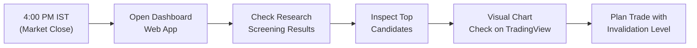

# Wyckoff & VSA Stock Screener — User Manual
### *A Practical Guide for NSE Indian Equity Research & Screening*

---

## 🌐 Quick Access
- **Live Web Application**: [https://wyckoff-stock-screener-mwf552gyf6gmnckm5u5bq4.streamlit.app/](https://wyckoff-stock-screener-mwf552gyf6gmnckm5u5bq4.streamlit.app/)
- **Target Market**: National Stock Exchange of India (NSE)
- **Timezone**: Indian Standard Time (IST)

---

## 1. What Is This Tool?

This screener scans NSE-listed Indian equities using **Richard Wyckoff's Structural Accumulation Framework** combined with **Tom Williams' Volume Spread Analysis (VSA)**.

### The Core Objective
To identify stocks where institutional buyers (*"smart money"*) appear to be quietly absorbing supply in a base or trading range before a potential upward price markup.

> ⚠️ **Important Golden Rule**:  
> This tool is a **research triage and screening tool, NOT automated financial advice or guaranteed buy signals**. Every flagged event is an unconfirmed candidate hypothesis backed by empirical volume and price spread metrics.

---

## 2. Daily 5-Minute Routine (For Mumbai / IST Traders)

### Recommended Step-by-Step Daily Workflow:
1. **After 4:00 PM IST**: Open the live dashboard link.
2. **Turn on 💡 Beginner Mode** (left sidebar) if you want instant plain-English explanations for all Wyckoff terminology.
3. **Step 1: Check Market-Wide Candidates**:
   - Go to **`📊 Research Screening Results`**.
   - Use the **📅 Calendar Date Selector** to pick the latest screening date (e.g. `2026-08-23`).
   - Look at the top-ranked **`⭐ High Priority`** and **`✅ Qualified`** candidates.
4. **Step 2: Inspect Individual Stocks in Depth**:
   - Switch to **`🏠 Home / Single Stock`**.
   - Type the ticker symbol (e.g. `TATAMOTORS.NS`, `ANANTRAJ.NS`, `HINDCOPPER.NS`) and click **"🔍 Fetch & Analyze Stock"**.
5. **Step 3: Review the 7 Core Analysis Cards**:
   - 🧠 **Why did the system select this stock?** (Summary narrative + positive evidence + caveats).
   - 📚 **Wyckoff Structural Interpretation** (Is it a Phase C Spring or Phase D LPS?).
   - 🎯 **What should I look at on the chart?** (Visual checklist with `✅`, `⚠️`, `❌`).
   - 📊 **Composite Score Breakdown** (How the 0–100 score is built from trend, recency, peer strength, and P&F upside).
   - 🔍 **Screening Checklist** (Expand to see exact moving average, RSI, and ATR contraction values).
   - ⚠️ **What could invalidate this setup?** (Note the exact support price level where the setup is proven wrong).
   - 📈 **Bruce Fraser Point & Figure Objective** (Horizontal count cause-and-effect price target).
6. **Step 4: Conduct Human Visual Chart Review on TradingView**:
   - Verify the stock on daily and weekly charts before taking any action.

---

## 3. How to Understand Candidate Categories

| Category Badge | Meaning & Recommended Action |
| :--- | :--- |
| **⭐ High Priority Candidate** | **Prime Focus**: Passed all mechanical trend/momentum filters (50>100 DMA, Weekly uptrend, RSI in 55–70 band, ATR/VCP contraction) and formed a recent candidate Wyckoff event on high volume or supply dry-up. |
| **✅ Qualified Candidate** | **Worth Reviewing**: Passed key technical qualification gates with accumulation characteristics. |
| **👁 Watchlist Candidate** | **Monitor for Setup**: Wyckoff event detected, but one or more technical moving averages or momentum indicators are currently lagging. |
| **🚫 Disqualified Setup** | **AVOID / RED FLAG**: Severe red flags detected (e.g. Upthrust After Distribution / UTAD or broken market structure). |

---

## 4. Wyckoff & VSA Cheat Sheet for Quick Reading

### The Core Wyckoff Events:
- **Spring (Phase C)**: A temporary false breakdown below trading range support that quickly reverses back into the range. *Traps short-sellers and tests remaining supply before a markup.*
- **LPS — Last Point of Support (Phase C/D)**: A shallow pullback that holds at a higher low on dry, low volume. *Shows sellers are exhausted and buyers are willing to support price at higher levels.*
- **SOS — Sign of Strength (Phase D/E)**: A wide-range green bar breaking above trading range resistance on elevated volume. *Signals active institutional demand overwhelming overhead supply.*
- **SC — Selling Climax (Phase A)**: High-volume panic sell-off bottom where institutions step in to absorb retail panic.
- **UTAD — Upthrust After Distribution (Bearish Alert)**: A false breakout above resistance that fails and collapses back inside. *Indicates smart money distribution.*

### The Key Volume Spread Ratios:
- **Volume Ratio $\ge 2.0x$**: Climactic / Institutional effort (very high volume compared to 20-day average).
- **Volume Ratio $< 0.75x$**: Volume Dry-up (lack of selling pressure on pullbacks).
- **Spread Ratio $\ge 1.5x$**: Wide spread (large price movement from High to Low).
- **Close Position $> 0.70$**: Strong close (closed in the top 30% of the day's range; buyers won the bar).
- **Close Position $< 0.30$**: Weak close (closed in the bottom 30% of the day's range; sellers dominated).

---

## 5. Understanding the Point & Figure (P&F) Target

The screener includes a timeless price projection method developed by **Bruce Fraser**:
- **Law of Cause and Effect**: The wider the horizontal consolidation base (Cause), the larger the potential vertical price move (Effect).
- **Count Formula**: $\text{Target Price} = \text{Count Row Price} + (\text{Columns} \times \text{Box Size} \times 3)$.
- **How to Use It**: Treat the P&F Target as an *analytical objective*, NOT a guaranteed target. If the setup is stale (anchor older than 60 bars), the dashboard will flag a ⚠️ warning.

---

## 6. What This Screener Does NOT Do (Critical Disclaimers)

1. **Not a Guaranteed Win Probability**: A composite score of 85/100 means the stock matches research criteria well — it does NOT mean an 85% probability of profit.
2. **No Automated Order Execution**: The screener will never place trades or connect to a broker.
3. **Un-Evaluated Factors**: The current engine evaluates purely daily OHLCV price and volume action. It does **not** evaluate:
   - Fundamental quarterly earnings / P/E ratios
   - Intraday order book depth (Level 2)
   - Corporate news announcements or geopolitical events
   - Broader Nifty 50 macro trends

---

## 7. Recommended Risk Management Rules

When acting on any qualified setup:
1. **Always set a hard Stop-Loss**: Place your stop loss strictly below the **Invalidation Level** shown in the ⚠️ *What could invalidate this setup?* card.
2. **Never risk more than 1–2% of your trading capital** on any single stock idea.
3. **Respect Disqualifications**: If a stock is labeled 🚫 **Disqualified**, do not try to buy the dip.
